# PR Review — UI rework and AI review plan

Date: 2026-09-27
Status: implemented (phases 0–6, most of 7) — see §8

Screenshots below come from the built app (`npm run build`, driven with
Playwright `_electron`), running against the real `react-web-monorepo`
repo at 1512×945.

---

## 1. What it looks like today

| Screen | Shot |
|---|---|
| Empty state | 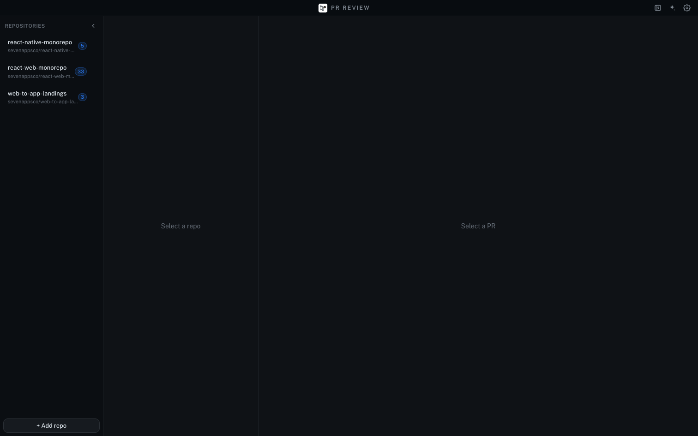 |
| Repo selected, list loading | 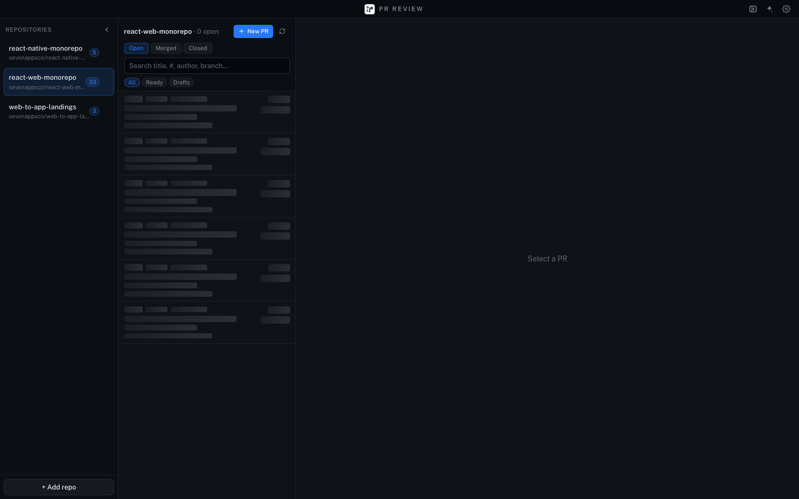 |
| PR detail (Files) | 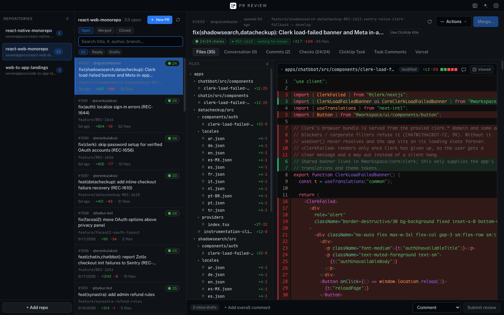 |
| PR detail with the AI panel open | 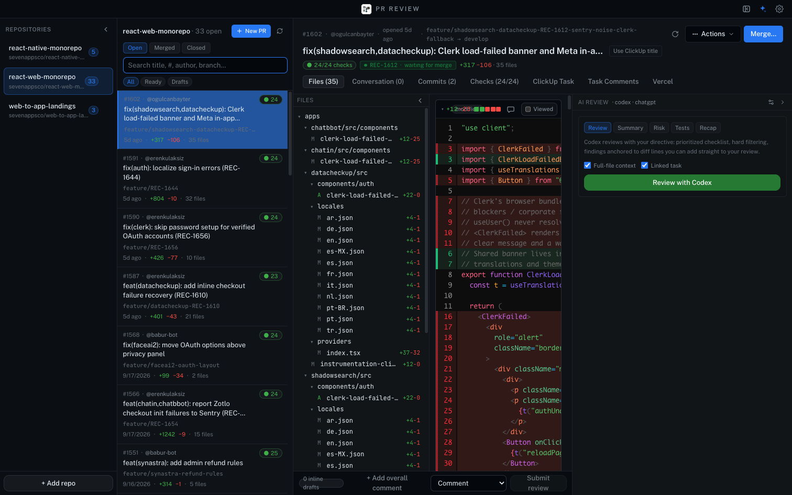 |
| Same view, sidebar collapsed to the rail | 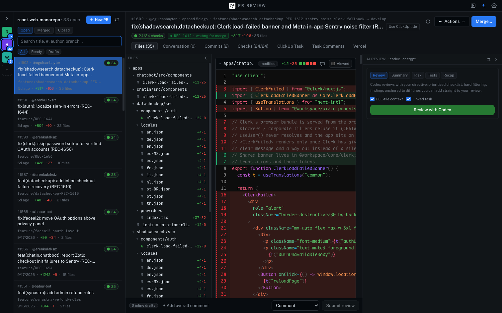 |
| Checks tab | 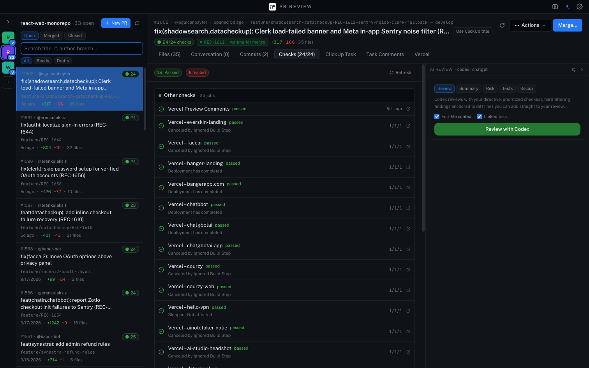 |
| Settings → AI | 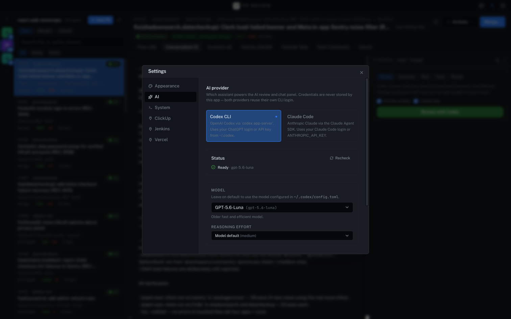 |
| AI review result (Codex, PR #1602, 35 files) | 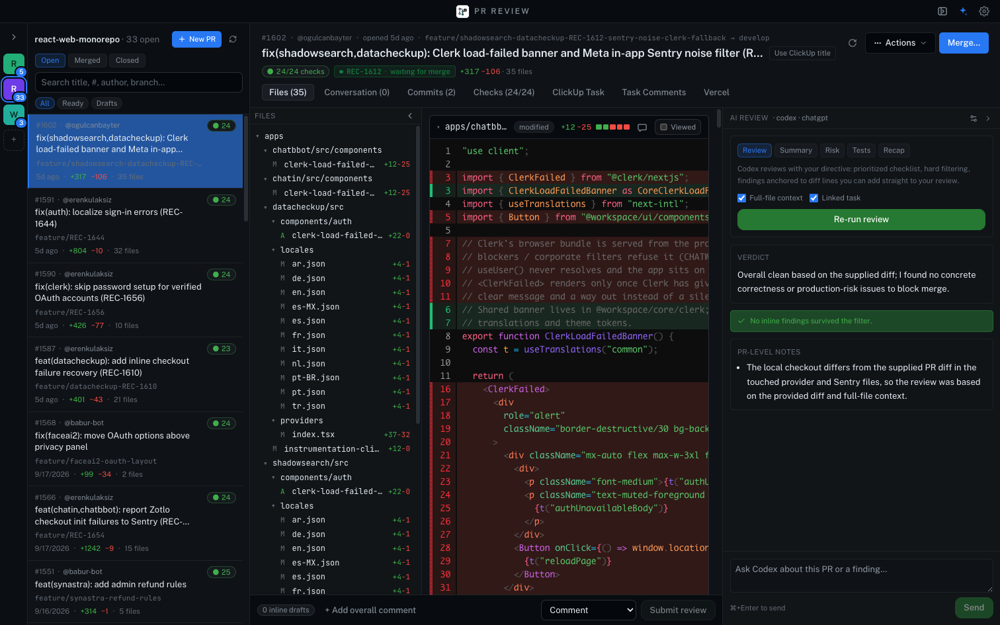 |

## 2. Diagnosis: why it feels bad

### Layout and space

1. **Five columns fight over 1512 px.** Repos (222) + PR list (336) + file
   tree (260) + diff + AI panel (410). With the AI panel open, **the diff,
   which is the whole point of the app, is ~420 px wide.** Lines are clipped
   at `import { ClerkFailed } fr…` (shot 04). Even the file header collapses
   into `+12-25` overlapping `modified` (shot 04, top of the diff).
2. **Selecting a PR doesn't change the layout.** The PR list stays full
   width while you review, as if browsing and reviewing were the same task.
   Nothing is ever put away.
3. **The repo sidebar is a list of three items taking a full column.** The
   rail mode (shot 05) uses coloured "R / R / W" letter tiles, so the two
   monorepos can't be told apart.
4. **The empty state is two grey "Select a repo" / "Select a PR" strings**
   on a 1300 px black canvas (shot 01). There's no inbox and no "what needs
   my attention".
5. **The review bar is squeezed.** When the AI panel is open, "0 inline
   drafts", "+ Add overall comment" and "Submit review" all wrap onto two
   lines (shot 04, bottom).

### Visual language

6. **It's a GitHub Primer clone** (`theme.css` uses Primer's exact hex
   values) without Primer's density rules, so it reads as generic and dated.
7. **Hierarchy is flat.** Everything is 13–14 px, grey on near-black.
   Metadata (`#1602 · @ogulcanbayter · opened 5d ago · feature/…-fallback →
   develop`) has the same visual weight as the title and wraps onto two
   lines (shot 03).
8. **Colour is overused.**
   - The selected PR is a saturated blue block with a grey branch name that
     you can barely read (shot 02/03).
   - The green "24" check pill appears on every row, and it's the same for
     every PR, so it adds no information.
   - "Review with Codex" is a full-width green button that looks like
     "Merge".
   - Deleted diff lines are a solid brown-red wall (shot 03).
9. **The diff font is too big for the space.** Mono at ~15 px with 20 px
   line height, in the narrowest column.
10. **The tab bar mixes three kinds of tab.** Core PR tabs (Files,
    Conversation, Commits, Checks) sit next to integration tabs (ClickUp
    Task, Task Comments, Vercel) with the same styling. ClickUp takes two
    tabs by itself.
11. **Buttons are inconsistent.** There are five styles: outline `Actions`,
    solid blue `Merge…`, ghost `Use ClickUp title`, chip filters and a
    native `<select>` for Comment/Approve.
12. **The title is centred and letter-spaced ("P R R E V I E W")** in a
    36 px title bar that does nothing else.

### Interaction

13. There's no keyboard-first flow: no j/k through files, no n/p through
    findings, and no ⌘K to jump to a PR.
14. Loading the list shows skeletons where "33 open" should already be
    available, and the header shows "0 open" while it loads (shot 02).

## 3. Diagnosis: why the AI review is bad

What I saw running it: I clicked "Review with Codex" on #1602 (+317/−106,
35 files). About 75 s later the result was: *"Overall clean… no concrete
correctness or production-risk issues"*, **0 findings**, and one note saying
*"the local checkout differs from the supplied PR diff"*.

Root causes, from the code and the run:

### Input quality: the model is reviewing blind

- **The model is `gpt-5.6-luna` with the default reasoning effort.**
  Settings says it's the "older fast and efficient model". That's the wrong
  tier for review, and `~/Library/Application Support/pr-review/ai.json`
  pins it.
- **Codex's working directory is the user's real checkout**, which is on a
  different branch. The model notices, stops trusting the repo, and falls
  back to the diff (`codex.ts:319`, and the note in shot 13). So it can't
  follow imports, find callers or read tests.
- **Full-file context is capped at 12 files**, silently
  (`ipc.ts:426`). On a 35-file PR, most files are reviewed from hunks
  alone.
- **Claude gets `tools: []`, `maxTurns: 1`, and a hardcoded
  `claude-sonnet-4-6`** (`client.ts:92-98`). It's a single-shot prompt with
  no repo access and no schema enforcement.

### Output UX: findings live in a sidebar, not in the code

- **Findings aren't shown in the diff until you click "Add to review".**
  "Jump" scrolls only to the file header (`PRDetail.tsx:233`).
- **Progress is opaque.** Review mode shows only "Drafting findings… N KB"
  while the model writes JSON (`AIReviewPanel.tsx:735`). You wait 1–3
  minutes without seeing anything.
- **The launcher is noise.** Review, Summary, Risk, Tests and Recap all
  compete, when a reviewer wants one good review plus follow-up chat.

### State: the review is thrown away constantly

- **Collapsing the panel or switching PRs unmounts `PanelBody`**, which
  cancels the running review and drops the result and chat
  (`AIReviewPanel.tsx:213`, `:319-324`).
- **Nothing is persisted.** There's no per-commit cache, no "stale: 2 new
  commits since review" and no incremental re-review.
- **Finding IDs are random** (`findings.ts:218`). Re-running can create
  duplicate draft comments.

### Bugs to fix regardless of the redesign

| # | Bug | Where |
|---|---|---|
| a | Jump highlight overrides the comment-composer selection until the PR changes | `DiffViewer.tsx:399`, `PRDetail.tsx:248` |
| b | "Apply fixes" sends dismissed findings too | `AIReviewPanel.tsx:464` |
| c | `suggestion` blocks emitted on LEFT-side and file-level comments, where GitHub won't render them | `shared/review.ts:23` |
| d | Unanchored findings render as `path:0` | `findings.ts:220` |
| e | Apply's embedded DiffViewer has a live comment composer that writes into the real PR draft | `AIReviewPanel.tsx:1244` |
| f | `ai:apply:progress` has no PR/stream id, and chunks are routed by `prNumber` only (not repo) | `ipc.ts:531`, panel `:310` |
| g | Cancelling throws away a partial result | `AIReviewPanel.tsx:374` |
| h | `applyPrompt.ts` still describes the old "Overview / Concerns / Suggestions" format | `applyPrompt.ts:5` |
| i | ClickUp API token stored in plaintext in `integrations.clickup.json` (use `safeStorage`) | integrations store |

---

## 4. Proposed design

### 4.1 Layout: two modes instead of five columns

**Inbox mode** (no PR open):

```
┌ traffic lights ─ [⌘K Search PRs, repos…] ──────────────── ⚙ ┐
│ Repos (compact)   │  Needs my review (4)                      │
│  ● react-web  33  │   #1602 fix(shadowsearch…)  ogulcan · 5d  │
│  ● react-native 5 │   #1591 fix(auth): localize…  eren  · 5d  │
│  ● w2a-landings 3 │  My PRs (6)  · Waiting on CI · Changes req│
│                   │  All open  (grouped, filterable)          │
└───────────────────┴───────────────────────────────────────────┘
```

- The list becomes a real inbox, grouped by *review requested from me*,
  *my PRs*, *re-review needed (new commits since my review)* and
  *everything else*. Use `gh search prs --review-requested=@me` and friends.
- Rows are one line for the title plus one quiet meta line. CI shows as a
  dot, and only when it isn't green. Branch names go on hover only.

**Review mode** (PR open). The PR list collapses into a thin switcher, so
the diff gets the space:

```
┌ ‹ react-web / #1602  fix(shadowsearch,datacheckup): Clerk load-failed…   [AI ✦] [Review ▾] [Merge] ┐
│ Files 35 · Conversation · Commits 2 · Checks ✓ · Integrations ▾                                      │
├──────────┬──────────────────────────────────────────────────────────┬─────────────────────────────┤
│ file tree│                     DIFF (≥ 60% width)                   │ AI review (optional, 360px) │
│ (toggle) │   finding annotations rendered inline under the line     │  verdict · findings list    │
└──────────┴──────────────────────────────────────────────────────────┴─────────────────────────────┘
```

- `‹` or `Esc` goes back to the inbox. `[`/`]` switch between PRs in the
  inbox without leaving review mode.
- Integrations (ClickUp, Jenkins, Vercel) move into one "Integrations"
  tab with sections, plus small status chips in the header.
- Review submission (Comment/Approve/Request changes plus the overall body)
  becomes a **popover from the `Review ▾` button**, like GitHub. That
  removes the always-on bottom bar that wraps. The draft count shows as a
  badge on the button.

### 4.2 Visual system

- **Own palette, not Primer.** Use a neutral, slightly warm-grey ramp
  (for example zinc/stone-based) with one accent. Status colours are for
  status only.
- **Type scale.** 12 meta, 13 body, 15 PR title, and mono at 12.5 px with a
  19 px line height for diffs. The title bar holds the ⌘K search instead of
  a spaced-out "P R R E V I E W".
- **Quieter selection.** The selected PR row gets a subtle raised surface
  and an accent bar on the left, not a solid blue block.
- **Diff colours.** Low-alpha backgrounds with a stronger colour only on
  the changed-word ranges (`@pierre/diffs` supports word diff). This
  removes the brown wall.
- **One button system:** `primary` (only Merge / Submit), `secondary`,
  `ghost` and `icon`, all built on the existing `ui/button.tsx` cva. Replace
  the native `<select>` with the Radix select that's already a dependency.
- **Density toggle** (comfortable / compact) in Appearance.

### 4.3 Keyboard

`⌘K` palette (PRs, repos, files, commands), `j/k` next/previous file,
`n/p` next/previous finding, `c` comment on the selected line, `a` add the
focused finding to the review, `x` dismiss it, `⌘⏎` submit the review, and
`?` for a cheatsheet.

---

## 5. AI review experience, redesigned

The goal is that opening a PR feels like a senior teammate has already
left their comments in the diff, and you're triaging them.

### 5.1 Give the model real context

1. **Use an isolated worktree at the PR head.**
   `git worktree add --detach <cache>/<repo>/<pr> <headRefOid>`, reused and
   updated with `git fetch` plus checkout. Codex and Claude run with
   `cwd` = the worktree, read-only. The model can then grep callers, open
   tests and read configs, and the "local checkout differs" problem goes
   away. The user's own checkout is never touched.
2. **Treat Claude as a peer, not second class.** Use the Agent SDK with
   read-only tools (`Read`, `Grep`, `Glob`) in the worktree, a model
   picker (default `claude-opus-5-5`, with `claude-sonnet-5` as the faster
   option), and structured output enforced with a JSON schema, like Codex
   `outputSchema`.
3. **Pick a model tier.** Offer "Thorough" (strong model, high effort) and
   "Quick". Default to Thorough for review mode. Show the model name on the
   result card so "0 findings from luna" is visible.
4. **Drop the 12-file cap.** Once the model has the worktree it pulls files
   itself. The prompt carries the diff, intent (PR body and linked task),
   and a ranked list of the riskiest files so it starts there.

### 5.2 Stream findings, not JSON bytes

- Have the model emit findings **one at a time**. Two ways to do that:
  - Codex / Claude tool calls (`report_finding({...})`) handled in the
    main process.
  - NDJSON lines parsed as they arrive.
- Each finding shows up in the diff and the list immediately.
- The progress card shows real steps from the agent's tool use:
  "Reading `packages/core/src/clerk/index.ts`", "Checking callers of
  `useUser`" and a counter such as "3 findings so far".
- Verdict and summary arrive last.

### 5.3 Findings live in the diff

- Render every anchored finding as a **line annotation directly under its
  line** in the diff, using `@pierre/diffs` line annotations. It shows a
  severity dot, title, body, an optional suggestion rendered as a mini diff,
  and the actions `[Add to review] [Edit] [Dismiss] [Ask]`.
- The right panel becomes an **index**: verdict at the top, then findings
  grouped by file and sorted by severity, with n/p navigation. Clicking one
  scrolls to the *exact line*, not the file header.
- Show finding markers in the file tree (a dot with a count) and in the
  scrollbar gutter.
- "Add to review" turns the annotation into a draft comment in place, with
  the same card restyled as a draft. There's no second copy.
- **Ask about this finding** opens chat scoped to the finding, so you can
  write "is this real? show me the caller" and get an answer backed by the
  worktree.
- Suggestions are applied locally one at a time when they're exact
  (`git apply` of the suggestion hunk in the worktree, or push). The
  "apply all via agent" flow stays for bigger fixes, and it respects
  dismissals.

### 5.4 Persistence and re-review

- **Store reviews per `(repo, pr, headOid)`** in electron-store or SQLite:
  findings, verdict, dismissals, chat and model. Reopening a PR shows the
  last review instantly.
- **Staleness banner:** "Reviewed at `a1b2c3d` · 2 new commits". Then
  **incremental re-review** runs on `git diff <oldHead>..<newHead>` plus the
  prior findings. The model marks each old finding as *fixed*, *still
  open* or *obsolete*, and adds new ones.
- **Stable finding IDs** are a hash of path, line-content fingerprint and
  title, so re-runs don't duplicate drafts and dismissals survive.
- **Background execution.** Reviews run in the main process and belong to
  a job registry, not to a React component. Collapsing the panel or
  switching PRs doesn't cancel anything. The inbox shows "✦ reviewing…" or
  "✦ 3 findings" per PR.
- Optional **auto-review** when a PR where you're a requested reviewer is
  opened or updated, capped at N in parallel.

### 5.5 Simplify the launcher

- One primary action: **Review** (a split button whose dropdown offers
  "Quick" and "Thorough"). Summary, Risk, Tests and Recap become chat
  prompt chips ("Summarize", "What could break?", "What tests are
  missing?") inside the same thread, reusing the same context.
- "Full-file context" and "Linked task" checkboxes go away, because the
  worktree makes the first unnecessary and the linked task is always
  included when one exists.

### 5.6 Quality loop

- A 👍/👎 on each finding, stored locally. Add a "Why dismissed?" quick
  reason (wrong, nit, already handled) that can be fed back into the
  directive as "things this team doesn't want".
- Show a **coverage line** on the result, for example "Read 28/35 changed
  files · 14 extra files · 3 min · $0.41", so a "clean" verdict is backed
  by visible effort.

---

## 6. Phasing

Each phase ships on its own.

| Phase | Scope | Size |
|---|---|---|
| **0. Bug fixes** | Items a–i in §3, plus the model default ("Thorough" tier) | S |
| **1. AI state and persistence** | Main-process job registry, per-headOid cache, stable IDs, background runs, staleness banner. Split `AIReviewPanel.tsx` (1422 lines) into `useReviewJob`, `FindingList`, `FindingCard`, `ApplyFlow`, `ChatThread` | M |
| **2. AI context** | PR worktree manager, Claude parity (tools, schema, model picker), remove the file cap, streaming findings via tool calls | M |
| **3. Findings in the diff** | Inline annotations, exact-line jump, tree and scrollbar markers, per-finding actions and scoped chat, single-suggestion apply | M |
| **4. Layout rework** | Inbox and review modes, header and tabs cleanup, review popover, integrations tab | L |
| **5. Visual system** | New tokens, type scale, button system, diff colours, density toggle | M |
| **6. Keyboard and ⌘K** | Palette and shortcuts | S |
| **7. Incremental re-review and auto-review** | Diff-since-last-review, fixed/open/obsolete status, auto triggers, feedback loop | M |

Suggested order: 0 → 1 → 2 → 3. That fixes the AI experience first, since
it's the main complaint. Then 4 → 5 → 6, then 7. Phases 4 and 5 can be done
behind a prototype first if you want to compare looks before committing.

## 7. Decisions (2026-09-27)

1. **Providers:** keep both Claude and Codex, with a per-review picker; neither is second-class.
2. **Worktrees:** approved under `~/Library/Application Support/pr-review/worktrees`, LRU-evicted at ~10.
3. **Inbox scope:** all open PRs in the added repos (current behaviour), not only ones involving me.
4. **Visual direction:** no prototypes. Target a **minimal, usable** UI: fewer colours, fewer controls, more room for the diff.
5. **Auto-review:** opt-in (default off).

## 8. Implementation status (2026-09-27)

| After | Shot |
|---|---|
| Inbox | 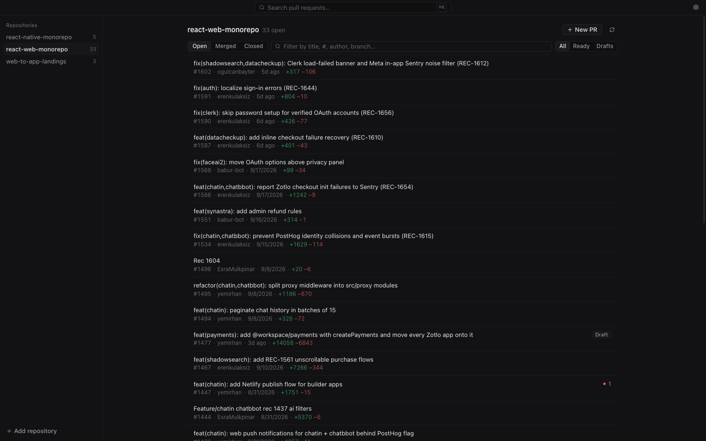 |
| Review streaming (plain-language progress) | 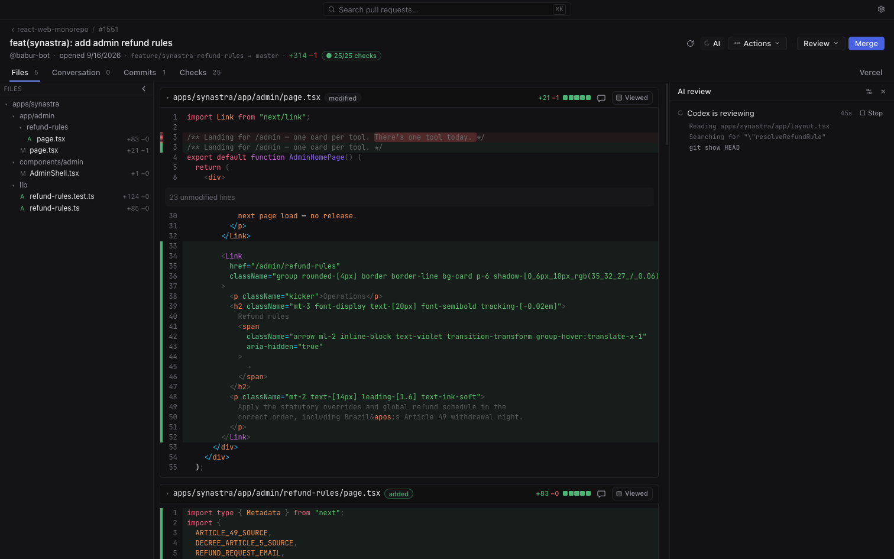 |
| Review done: verdict, findings index, file-tree markers | 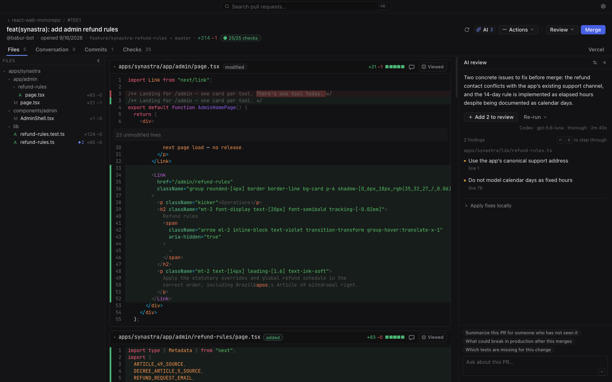 |
| Jump to finding: card under its line | 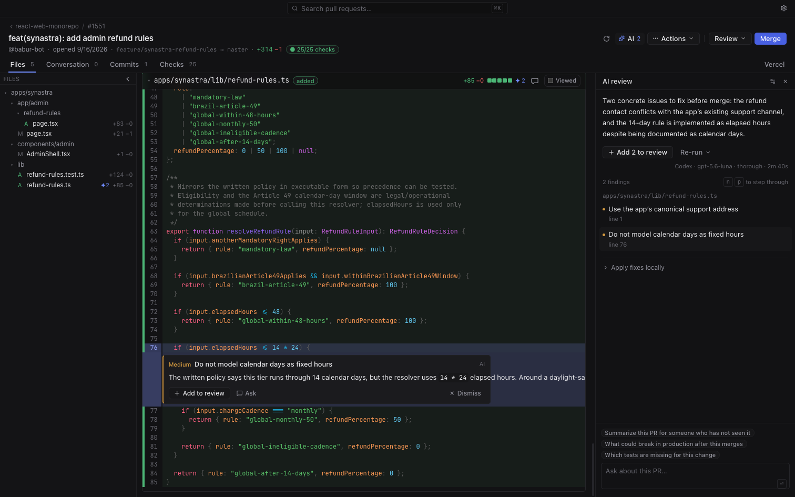 |
| Added to review (draft bubble, Review badge) | 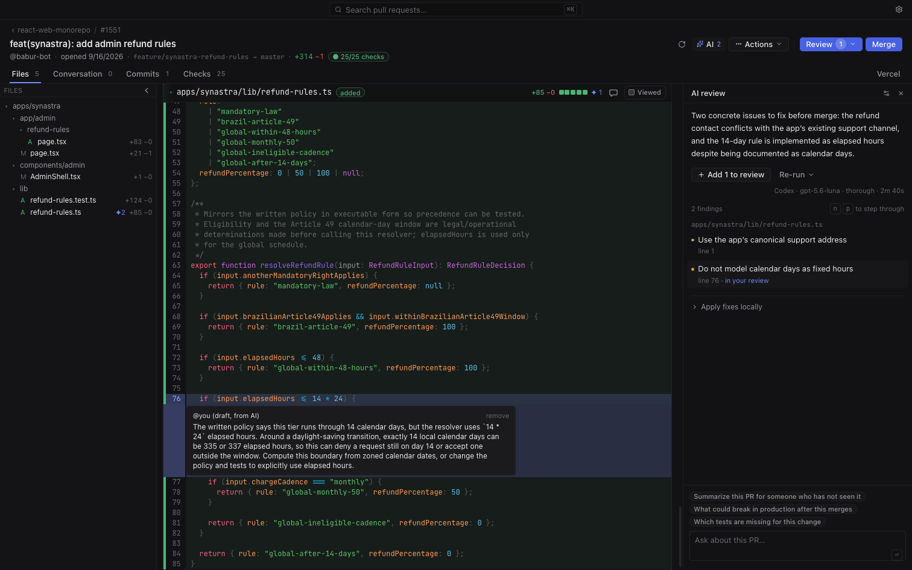 |
| "Ask" about a finding, answered from the checkout | 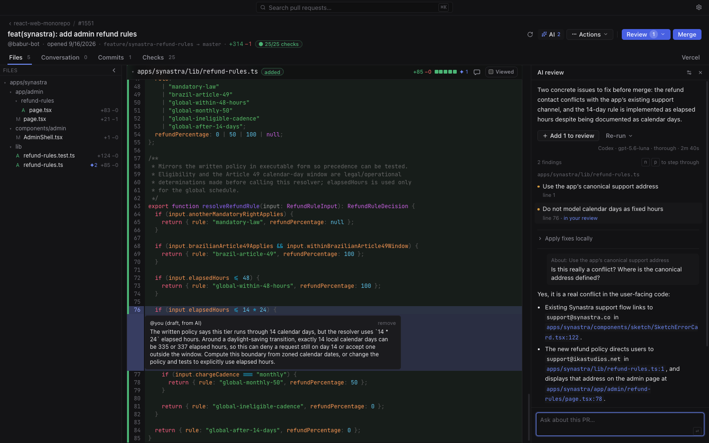 |
| ⌘K palette | 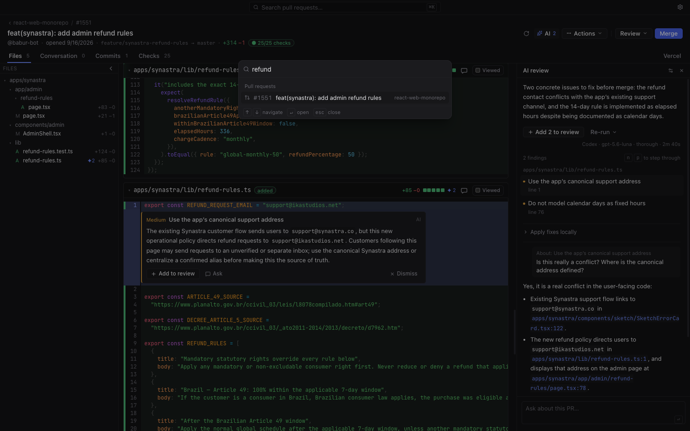 |
| Light theme | 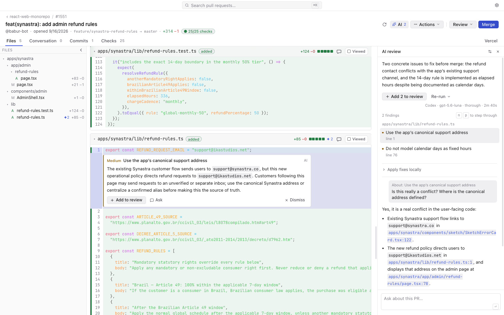 |

Done:
- **AI sessions in the main process** (`src/main/ai/sessions.ts`): reviews and chat survive panel collapse / PR switches, stream to every window (`ai:session`), and are persisted per PR (`ai-sessions.json`, latest 150).
- **PR worktree** (`src/main/git/worktree.ts`): read-only checkout of the PR head under `userData/worktrees`, fetched via a private `refs/pr-review/pr-N` ref, LRU 10. Fallback: GitHub file contents + diff.
- **Claude parity** (`client.ts`): Read/Grep/Glob confined to the checkout via `canUseTool`, JSON-schema output, model picker (Opus 5 default, Opus 5.5, Sonnet 5 for quick).
- **Depth**: Quick / Thorough per review (Codex effort low/high unless overridden; Claude model choice).
- **Streaming findings**: partial-JSON extraction shows findings as they're written; progress lines are humanized ("Reading x", "Searching for y").
- **Stable finding ids** (hash of path, anchored line text, title) → no duplicate drafts, dismissals survive re-runs.
- **Re-review** feeds previous open findings and dismissed ones into the prompt; stale banner when the head moved.
- **Findings in the diff** (`ai/FindingInline.tsx`) with Add / Ask / Dismiss; exact-line jump; `n`/`p`; file-tree ✦ counts.
- **Ask about a finding**: chat scoped to the finding, answered with checkout access.
- **Bug fixes a–i** from §3 (incl. read-only apply preview, streamId-scoped apply progress, suggestion blocks only on RIGHT-side anchored comments, encrypted integration tokens via `safeStorage`).
- **Layout**: inbox vs full-width review mode, Esc / `[` `]` / ⌘K, Review popover instead of the bottom bar, quieter tabs, integrations right-aligned, ClickUp merged into one tab.
- **Visual system**: neutral palette, native font, one button system, soft diff colours.
- **Settings**: default depth, Claude model, opt-in auto-review.

- **PR tabs** (added after the first pass): browser-style tabs in the title bar with the inbox as a fixed first tab. Tabs persist across restarts, ⌘-click / middle-click opens a PR in the background, and the hover "Review" action on inbox rows starts an agent in a background tab. Tab icons show a spinner while a review runs and a dot when it finished unseen. Shortcuts: ⌘W close, ⌘1–9, ⌃Tab / ⌘⇧[ ], Esc to the inbox. Only the active tab is mounted, with its sub-tab and scroll restored. Worktree git operations are serialized per repo, and worktrees in use are never evicted.

- **PR worktrees** (`src/main/git/workspaces.ts`): "Check out" creates `<repo>.worktrees/pr-N` via `gh pr checkout` (falls back to a `pr-N/<branch>` local name when the branch is checked out elsewhere); the main checkout never switches. Editor, apply-fixes and push target the PR's worktree; push goes to the branch upstream (forks work). The AI review reuses the worktree when it's clean and at the head. Cleanup: Settings → Worktrees (per-row remove, "Remove merged & closed", clear AI review cache), Actions → Remove worktree, and a banner on merged/closed PRs. Removal refuses to drop uncommitted/unpushed work without a second confirmation and only deletes branches it created that are fully pushed.

Not done yet:
- True incremental re-review of only `oldHead..newHead` with per-finding fixed/open/obsolete status (re-runs are full reviews that know the prior findings).
- 👍/👎 feedback and "why dismissed" reasons.
- "Read N of M files" coverage line (model, depth, duration and cost are shown).
- Scrollbar-gutter finding markers; applying a single suggestion locally without the agent.

- **Builds (Jenkins + Vercel)**: one "Builds" tab per PR, next to Checks, replaces the separate Jenkins and Vercel tabs, plus a header chip ("2 builds failed" / "3 building" / "8/8 builds"). Jenkins rows show result, duration or live progress vs. the usual duration, and commit (struck through when it isn't the PR head). They have Rebuild, Stop (with confirm) and open-in-Jenkins; the first failing pipeline opens with stages, failed tests and the log tail. Vercel rows have Visit / Inspect and history; skipped/canceled apps fold into one line. Branch jobs are matched via the URLs Jenkins returns (handles `feature%2Fx` and `PR-<n>` jobs), branch lists are cached for 60 s, and polling is fast only while something runs. Settings: connection cards with status (a rejected token is shown with "Update token", and URL/username are kept), and tokens are no longer sent to the renderer. Jenkins pipelines are picked from the server's own list (search, Link all/Unlink all, "Detect repos" reads job configs, missing links are flagged with a one-click replacement); CSV import and hand-typed job paths are gone. Vercel needs no mapping: projects are matched to repos through their GitHub link, the scope is a team picker, and projects can be hidden per PR view. Tested against a mock Jenkins (the saved real token currently gets 401) and the real Vercel team.

- **Settings revamp**: Settings is now a full-window page (Esc / Back / any tab returns) instead of a modal. Its nav is grouped into App (General, AI review, Repositories, Worktrees, Tools) and Integrations (ClickUp, Jenkins, Vercel), with status dots for connected/broken integrations, AI auth and missing tools. Every page uses the same primitives (`settings/primitives.tsx`): page title, group cards, and rows with the label on the left and the control on the right, plus one segmented control and one switch. This replaces the mix of saturated selection cards, radios and nested cards. New Repositories page (reveal, open on GitHub, remove with confirm). ClickUp gets the same connection card and its token is no longer sent to the renderer; the per-repo List ID / status mapping was removed because nothing read it. Jenkins "Detect repos" now also suggests unlinking pipelines that build other repos. Verified against the real Jenkins (57 pipelines, config.xml readable, PR #1376 builds), real Vercel and real ClickUp.
